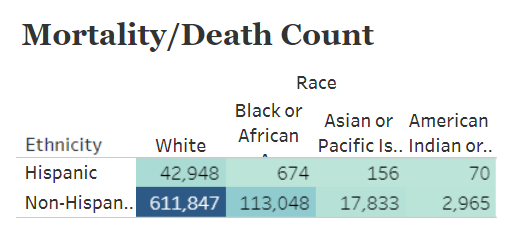
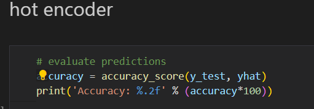
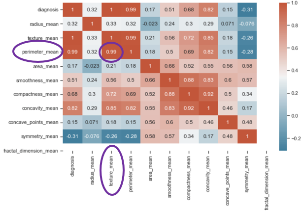
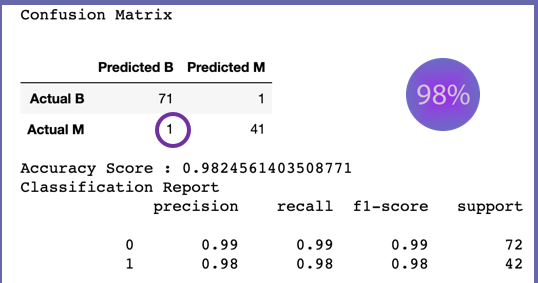

# BREAST CANCER ANALYSIS

## INTRODUCTION
Breast cancer is the second most common cancer among women in the United States. Each year in the United States, about 264,000 cases of breast cancer are diagnosed in women and about 2,400 in men. One of every five deaths in the United States is due to cancer. We also were keen to know how best we can analyze detection of breast cancer.

Therefore, we used [United States Cancer Statistics](https://www.cdc.gov/cancer/uscs) (USCS) which is the official federal statistics on cancer incidence from registries having high-quality data and cancer mortality statistics for 50 states. USCS is produced by the Centers for Disease Control and Prevention (CDC) and the National Cancer Institute (NCI). Our breast cancer data was taken from University of Wisconsin. (http://www.cs.wisc.edu/~olvi/uwmp/mpml.html)

## MOTIVATION
October is breast awareness month which was motivation to choose the data. Therefore, breast cancer was the data of choice.

## ANALYSIS QUESTIONS
- What is the incidence and mortality rate of breast cancer in the United States from 2000-2018? 
- Which race, and ethnicity has higher incidence and mortality rates and is the most affected?
- Which gender/sex has higher incidence and mortality rates?
- How accurately we can detect breast cancer.

## METHODOLOGY
Jupyter notebook was used to process and clean all data sets (we took three data sets). After cleaning them we performed Linear Regression and Logistic regression on incidence and mortality data sets to predict and look for accuracy scores. For breast cancer detection we performed Detection Tree Classifier , Random Forest and Logistic regression to accurately predict dtection of cancer.

## ERD DIAGRAM

## RESULTS

**Linear Regression** - We analyzed the relationship of race and gender to the incident and mortality rate of Breast Cancer. And we found that 24% of African American has highest breast cancer death rate. 

We also looked into relation of ethnicity with race, and which race or ethnicity is most affected.

**Logistic Regression** was also performed on incidence data to look for accuracy for the model. And we were able to get 100% accuracy score.

For **breast cancer detection** correlation heatmap matrix was performed which provided a good correlation for texture and perimeter as seen in output below.

Logistic regression for detection of breast cancer provided 98% of accuracy score, which was better than other models. However, there was still one false negative found.

## LIMITATIONS of Dataset
- Not having patient demographic data.
- Still 1 false negative. 
- Recent data not easily available

## STRENGTHS of Dataset
- Statistical dataset with categorical variables
- Model can be used for other cancers or other diseases
- No missing values in the dataset.
- Mostly numerical data.
- Potential application with patient triage

## FUTURE WORK

*Statistical Vizualization*
- Add data from 2019 to present
- Add interactive linear models to the webpage
- Include age-grouped data
- Expand globally

*Breast Cancer Detection*
- Retrain the model with a larger dataset. 
- Build a tool where doctors can provide inputs and see the results for their patients.
- Expand the model for other types of cancer.

## Citation: 
United States and Puerto Rico Cancer Statistics. (n.d.). Center for Disease Control and Prevention. Retrieved October 15, 2022, from https://wonder.cdc.gov/cancer-v2019.HTML
## Data : 
          United States Breast Cancer Statistics, 2000-2019 Incidence Data
          United States Breast Statistics, 2000-2019 Mortality Data
